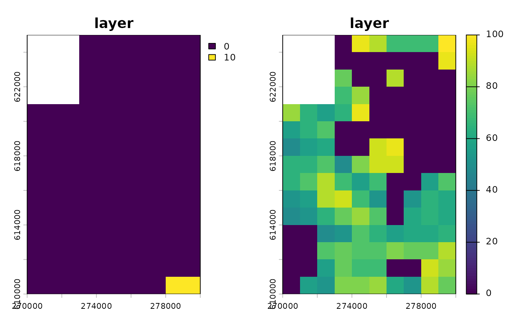
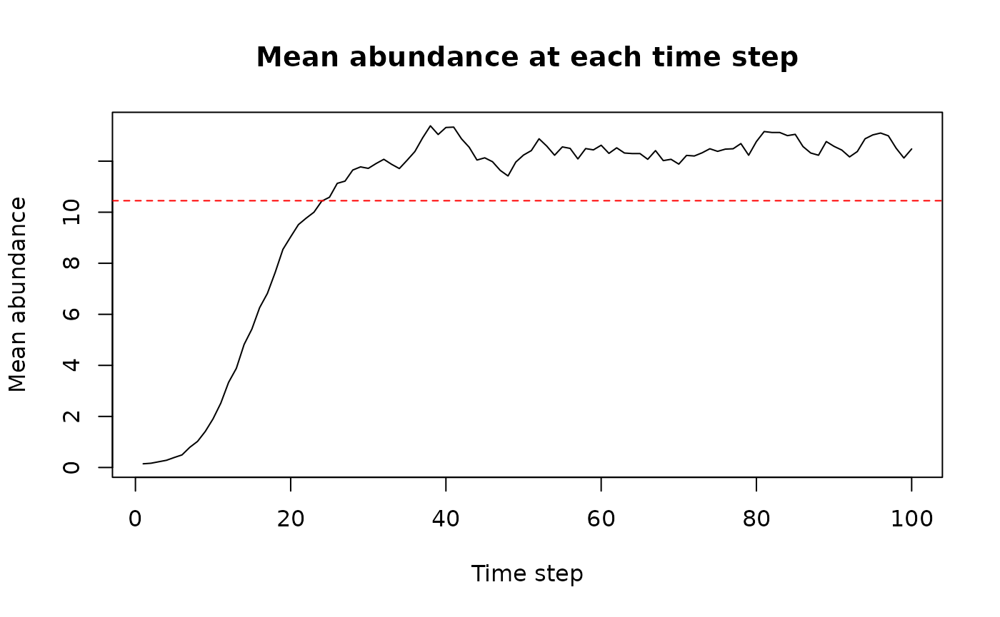
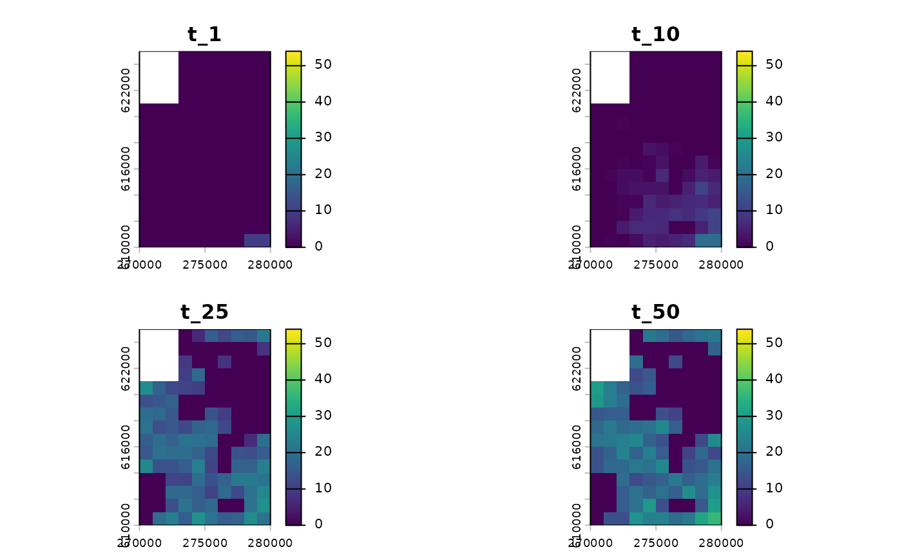
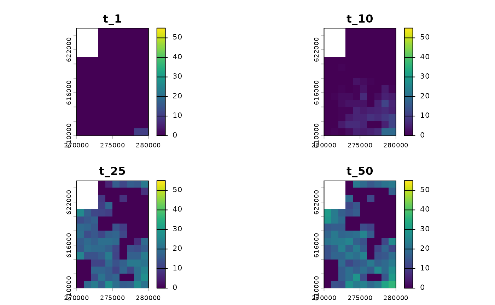
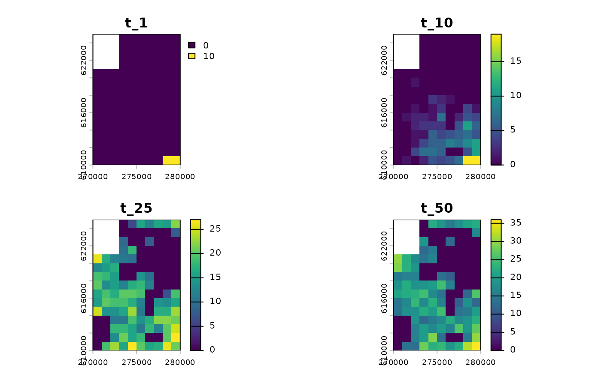
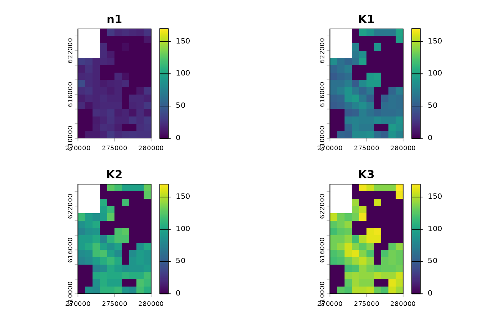
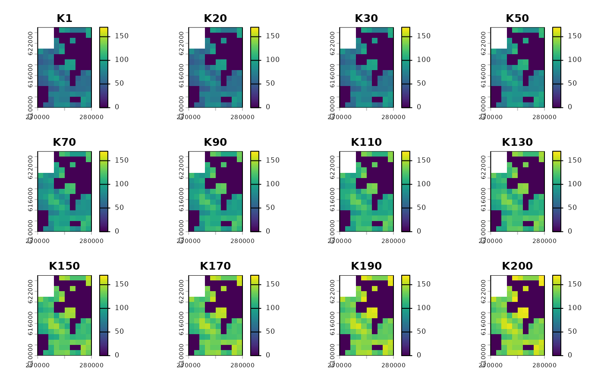
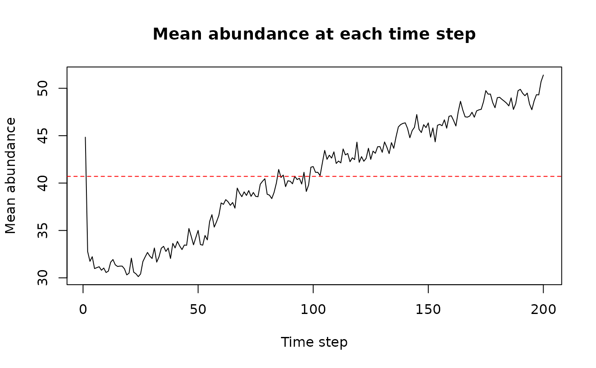
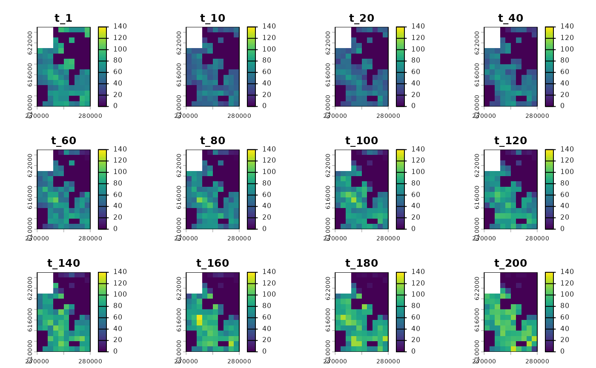

# How to use rangr?

## About `rangr`

This vignette shows an example of a basic use of the `rangr` package.
The main goal of this tool is to simulate species range dynamics. The
simulations can be performed in a spatially explicit and dynamic
environment, allowing for projections of how populations will respond to
e.g. climate or land use changes. Additionally, by implementing various
sampling methods and observational error distributions, it can
accurately reflect the structure of original survey data or simulate
random sampling.

Here, we showcase the full capabilities of our package, from creating a
virtual species to performing simulation and visualization of results.

## Basic workflow

In this chapter we will show you how to perform basic simulation using
maps provided with the package.

### Installing the package

First we need to install and load the `rangr` package.

``` r

install.packages("rangr")
library(rangr)
```

Since the maps in which the simulation takes place have to be in the
`SpatRaster` format, we will also install and load the `terra` package
to facilitate their manipulation and visualisation.

``` r

install.packages("terra")
library(terra)
```

### Input maps

One of the most important input parameters for simulation are maps
specifying the abundance of the virtual species at the starting point of
the simulation and carrying capacity of environment in which simulation
takes place. In this section, we will not generate them from scratch.
Instead, we will use maps provided with the package.

Example maps available in rangr in the Cartesian coordinate system:

- `n1_small.tif`
- `n1_big.tif`
- `K_small.tif`
- `K_small_changing.tif`
- `K_big.tif`

Example maps available in rangr in the longitude/latitude coordinate
system:

- `n1_small_lon_lat.tif`
- `n1_big_lon_lat.tif`
- `K_small_lon_lat.tif`
- `K_small_changing_lon_lat.tif`
- `K_big_lon_lat.tif`

You can find additional information about these data sets in help files:

``` r

?n1_small.tif
?K_small.tif
```

We will use these two datasets right now:

- `n1_small.tif` - as abundance at the starting point,

- `K_small.tif` - as carrying capacity.

To read the data we can use `rast` function from the `terra` package:

``` r

n1_small <- rast(system.file("input_maps/n1_small.tif", package = "rangr"))
K_small <-  rast(system.file("input_maps/K_small.tif", package = "rangr"))
```

Since both of these maps refer to the same virtual or in this case real
environment (a small region located in northwestern Poland), they must
have the same dimensions, resolution, geographical projection etc. The
only differences between them may be the values they contain and the
number of layers. You can use multiple layers in the carrying capacity
map to create a dynamic environment during the simulation, but in this
example, we will demonstrate a static environment.

Let’s take a closer look at them:

``` r

n1_small
#> class       : SpatRaster
#> size        : 15, 10, 1  (nrow, ncol, nlyr)
#> resolution  : 1000, 1000  (x, y)
#> extent      : 270000, 280000, 610000, 625000  (xmin, xmax, ymin, ymax)
#> coord. ref. : ETRS89 / Poland CS92
#> source      : n1_small.tif
#> name        : layer
#> min value   :     0
#> max value   :    10
K_small
#> class       : SpatRaster
#> size        : 15, 10, 1  (nrow, ncol, nlyr)
#> resolution  : 1000, 1000  (x, y)
#> extent      : 270000, 280000, 610000, 625000  (xmin, xmax, ymin, ymax)
#> coord. ref. : ETRS89 / Poland CS92
#> source      : K_small.tif
#> name        : layer
#> min value   :     0
#> max value   :   100
```

Above, you can see the dimensions and other basic characteristics of the
sample maps. The only field that differs between these maps is the value
field.

Now we will use the `plot` function to visualise input maps to get an
even better idea of what we’re working with.

``` r

plot(c(n1_small, K_small))
```



Input maps

Several things are noticeable here:

1.  The shape is the same for both maps, and in both cases, the upper
    left corner of the map is excluded from the simulation area and is
    treated as if it were outside the map’s extent. To create such an
    irregular shape, `NA` must be assigned to a particular cell or group
    of cells.

2.  The initial population is only located in the lower right corner of
    the simulation area and occupies two cells. Each of them contains 10
    individuals (you can use the
    [`values()`](https://rspatial.github.io/terra/reference/values.html)
    function to check).

3.  The carrying capacity map has areas that are unsuitable for the
    presented virtual species, as well as areas where it can have a
    positive population growth rate.

### Initialise

Now that we have input maps, we will use the
[`initialise()`](https://docs.ropensci.org/rangr/reference/initialise.md)
function to set other input parameters and generate a `sim_data` object
that will contain all the necessary information to perform a simulation.

The most basic
[`initialise()`](https://docs.ropensci.org/rangr/reference/initialise.md)
call will look as follows:

``` r

sim_data_01 <- initialise(
  n1_map = n1_small,
  K_map = K_small,
  r = log(2),
  rate = 1 / 1e3
)
```

Let’s break down this command:

- `n1_map` and `K_map` refer to the input maps described earlier.

- The `r` parameter is used to set the intrinsic population growth rate.
  The default population growth function is the Gompetz function.

- The `rate` parameter is related to the `kernel_fun` parameter, which
  by default is set to an exponential function (`rexp`). Therefore,
  `rate` determines the shape of the dispersal kernel (the mean
  dispersal distance is 1/rate).

We have now set up the simulation environment along with the demographic
and dispersal processes. This is the most basic setup needed to run your
first simulation, and that’s what we’ll do in the next step.

But first, let’s see what other information `sim_data` contains and what
happened behind the scenes during initialisation.

First, let’s check the class of `sim_data` object:

``` r

class(sim_data_01)
#> [1] "sim_data" "list"
```

As you can see `sim_data` is a `sim_data` object that inherits from
`list` objects so it is possible to change values of this object by
hand. However, we strongly encourage you to use
[`update()`](https://rspatial.github.io/terra/reference/update.html)
function instead to avoid errors and problems with data integration.

To take a closer look at `sim_data` you can also use
[`print()`](https://rdrr.io/r/base/print.html) or
[`summary()`](https://rspatial.github.io/terra/reference/summary.html)
function:

``` r

summary(sim_data_01)
#> Summary of sim_data object
#> 
#> n1 map summary: 
#>    Min. 1st Qu.  Median    Mean 3rd Qu.    Max.     NAs 
#>  0.0000  0.0000  0.0000  0.1449  0.0000 10.0000      12 
#> 
#> Carrying capacity map summary: 
#>    Min. 1st Qu.  Median    Mean 3rd Qu.    Max.     NAs 
#>    0.00    0.00   56.00   44.84   72.00  100.00      12 
#>                       
#> growth        gompertz
#> r               0.6931
#> A                    -
#> kernel_fun        rexp
#> dens_dep           K2N
#> border       absorbing
#> max_dist          2000
#> changing_env     FALSE
#> dlist             TRUE
```

It will show the summary of both input maps, as well as list of other
most important parameters such as `r` that we set up earlier.

### Simulation

All you need to run a simulation is a `sim_data` object and a specified
number of time steps to simulate. In addition, you can use the `burn`
parameter to discard a selected number of initial time steps if this
makes sense for your research or experiment.

In this first example, we will only set the `time` parameter as we want
to observe how our virtual species disperses and reproduces.

``` r

sim_result_01 <- sim(obj = sim_data_01, time = 100)
```

Again we will check the class of returned object:

``` r

class(sim_result_01)
#> [1] "sim_results" "list"
```

Similar to `initialise`, `sim` also returns an object that inherits from
`list`, but in this case it is called `sim_results`. This list has 3
elements such as:

- `extinction` - `TRUE` if the population is extinct or `FALSE`
  otherwise

- `simulated_time` - number of simulated time steps without the burn-in

- `N_map` - 3-dimensional array representing the spatiotemporal
  variability of population numbers. The first two dimensions correspond
  to the spatial aspect of the output and the third dimension represents
  time.

The best way to take a closer look at the results is to call a summary
function.

``` r

summary(sim_result_01)
```



    #> Summary of sim_results object
    #> 
    #> Simulation summary: 
    #>                     
    #> simulated time   100
    #> extinction     FALSE
    #> 
    #> Abundances summary: 
    #>    Min. 1st Qu.  Median    Mean 3rd Qu.    Max.     NAs 
    #>    0.00    0.00   12.00   10.45   19.00   54.00    1200

It gives you a quick and easy overview of the simulation results by
providing simulation time, extinction status and a summary of all maps
with abundances. It also produces a plot which can be useful for
determining the value of the `burn` parameter.

### Visualisation

With `rangr` we have provided an easy way to visualise selected time
steps from the simulation. This can be done using the generic plot
function:

``` r

plot(sim_result_01,
  time_points = c(1, 10, 25, 50),
  template = sim_data_01$K_map
)
```



Abundances

    #> class       : SpatRaster
    #> size        : 15, 10, 4  (nrow, ncol, nlyr)
    #> resolution  : 1000, 1000  (x, y)
    #> extent      : 270000, 280000, 610000, 625000  (xmin, xmax, ymin, ymax)
    #> coord. ref. : ETRS89 / Poland CS92
    #> source(s)   : memory
    #> names       : t_1, t_10, t_25, t_50
    #> min values  :   0,    0,    0,    0
    #> max values  :  10,   19,   27,   36

You can also adjust its parameters to get more breaks on the color
scale:

``` r

plot(sim_result_01,
  time_points = c(1, 10, 25, 50),
  breaks = seq(0, max(sim_result_01$N_map + 5, na.rm = TRUE), by = 5),
  template = sim_data_01$K_map
)
```



Abundances

    #> class       : SpatRaster
    #> size        : 15, 10, 4  (nrow, ncol, nlyr)
    #> resolution  : 1000, 1000  (x, y)
    #> extent      : 270000, 280000, 610000, 625000  (xmin, xmax, ymin, ymax)
    #> coord. ref. : ETRS89 / Poland CS92
    #> source(s)   : memory
    #> names       : t_1, t_10, t_25, t_50
    #> min values  :   0,    0,    0,    0
    #> max values  :  10,   19,   27,   36

If you prefer to work with rasters, you can also convert any
`sim_result` object into `SpatRaster` using the
[`to_rast()`](https://docs.ropensci.org/rangr/reference/to_rast.md)
function:

``` r

# raster construction
my_rast <- to_rast(
  sim_result_01,
  time_points = 1:sim_result_01$simulated_time,
  template = sim_data_01$K_map
)

# print raster
my_rast
#> class       : SpatRaster
#> size        : 15, 10, 100  (nrow, ncol, nlyr)
#> resolution  : 1000, 1000  (x, y)
#> extent      : 270000, 280000, 610000, 625000  (xmin, xmax, ymin, ymax)
#> coord. ref. : ETRS89 / Poland CS92
#> source(s)   : memory
#> names       : t_1, t_2, t_3, t_4, t_5, t_6, ...
#> min values  :   0,   0,   0,   0,   0,   0, ...
#> max values  :  10,  11,  14,  16,  20,  13, ...
```

And then visualise it using the
[`plot()`](https://rspatial.github.io/terra/reference/plot.html)
function:

``` r

# plot selected time points
plot(my_rast, c(1, 10, 25, 50))
```



Abundances

### Virtual Ecologist

If you want to sample the abundance of your virtual species population
and mimic the observation process, you can use the
[`get_observations()`](https://docs.ropensci.org/rangr/reference/get_observations.md)
function. Depending on the `type` argument, observation sites can be
selected randomly or their coordinates can be provided as a
`data.frame`.

Here we will demonstrate the most basic variant of the
[`get_observations()`](https://docs.ropensci.org/rangr/reference/get_observations.md)
function. To do this we will need both the `sim_results` object and the
`sim_data` object used to generate the simulated data. We will randomly
select observation sites, and in this variant we need to specify what
proportion of all sites we want to make observations on. Here we will
select 10% of the sites, so the `prop` argument is set to 0.1. There are
two random observation processes available: one where the observation
sites are the same at all time steps, and the other where the
observation sites are different at each time step. To see how the first
version works, we set the `type` argument to `"random_one_layer"`.

``` r

set.seed(123)
sample_01 <- get_observations(
   sim_data_01,
   sim_result_01,
   type = "random_one_layer",
   prop = 0.1
)
str(sample_01)
#> 'data.frame':    1500 obs. of  4 variables:
#>  $ x        : num  279500 271500 279500 274500 279500 ...
#>  $ y        : num  623500 618500 612500 619500 610500 ...
#>  $ time_step: int  1 1 1 1 1 1 1 1 1 1 ...
#>  $ n        : num  0 0 0 0 10 0 0 0 0 0 ...
```

The returned `data.frame` contains the geodetic coordinates of the
survey sites, the population abundances, and the time steps from which
the abundances were observed. To confirm that the survey sites remain
the same in each time step, and to obtain the coordinates of these
sites, we can use the following code:

``` r

unique(sample_01[c("x", "y")])
#>         x      y
#> 1  279500 623500
#> 2  271500 618500
#> 3  279500 612500
#> 4  274500 619500
#> 5  279500 610500
#> 6  277500 610500
#> 7  271500 614500
#> 8  272500 614500
#> 9  272500 610500
#> 10 273500 614500
#> 11 272500 611500
#> 12 274500 623500
#> 13 274500 614500
#> 14 270500 613500
#> 15 273500 616500
```

Here we sampled 15 sites.

The observation process is not perfect due to, among other things, the
detectability of the species or the skill of the observer. To mimic
this, we need to set `obs_error` and `obs_error_param` arguments, which
set the level of random noise in the observation process generated from
the log-normal distribution or the binomial distribution. Here we will
use the first one.

``` r

sample_01 <- get_observations(
   sim_data_01,
   sim_result_01,
   type = "random_one_layer",
   prop = 0.1,
   obs_error = "rlnorm",
   obs_error_param = log(1.2)
)
```

Now let’s demonstrate the second random observation process. We will set
the `type` argument to `"random_all_layers"`. This version ensures that
the study sites are re-sampled at each time step.

``` r

set.seed(123)
sample_02 <- get_observations(
   sim_data_01,
   sim_result_01,
   type = "random_all_layer",
   prop = 0.1,
   obs_error = "rlnorm",
   obs_error_param = log(1.2)
)
```

Let’s have a look which observation sites were sampled this time.

``` r

coords_02 <- unique(sample_02[c("x", "y")])
nrow(coords_02)
#> [1] 138
```

Here we looked at 138 observed sites (all available), each of which was
“visited” at least once.

## More advanced workflow

The previous workflow was quite basic. Now we will present a more
advanced one and use it to show some of the other parameter options.

### Input maps

#### Abundances at the first time step

As mentioned earlier, `rangr` has the ability to simulate virtual
species in a changing environment, and in this example we will show you
how to do this. For a better illustration we should start with a more
populated map than the `n1_small` used before. The easiest way to do
this is to use the abundances from the last time step of the previous
simulation as input for the current one. This can be done as follows:

``` r

n1_small_02 <- n1_small
values(n1_small_02) <- (sim_result_01$N_map[, , 100])
```

#### Carrying capacity

To simulate a changing environment, we need to specify the changes we
want. Essentially you need a carrying capacity map for each time step of
the simulation. You can generate these yourself, or you can generate
maps only for a few key time steps (at least the first and last) and
then use
[`K_get_interpolation()`](https://docs.ropensci.org/rangr/reference/K_get_interpolation.md)
to generate the missing ones. Here we will choose the second option and
use the `K_small_changing` object that comes with `rangr`. Below you can
see its summary:

``` r

K_small_changing <- rast(system.file("input_maps/K_small_changing.tif", 
                                     package = "rangr"))
K_small_changing
#> class       : SpatRaster
#> size        : 15, 10, 3  (nrow, ncol, nlyr)
#> resolution  : 1000, 1000  (x, y)
#> extent      : 270000, 280000, 610000, 625000  (xmin, xmax, ymin, ymax)
#> coord. ref. : ETRS89 / Poland CS92
#> source      : K_small_changing.tif
#> names       : layer.1, layer.2, layer.3
#> min values  :       0,       0,       0
#> max values  :     100,     130,     170
```

As you can see, the carrying capacity increases in each map, meaning
that our environment is becoming more and more suitable for the virtual
species. It is also worth noting that the first layer of
`K_small_changing` is the same as `K_small`. Again, we can visualise all
the input maps using the plot function:

``` r

plot(c(n1_small_02, K_small_changing),
     range = range(values(c(n1_small_02, K_small_changing)), na.rm = TRUE),
     main = c("n1", paste0("K", 1:nlyr(K_small_changing))))
```



Input maps

This raster has 3 layers so we can either run a simulation with only 3
time steps (which seems rather pointless) or, as mentioned, use the
[`K_get_interpolation()`](https://docs.ropensci.org/rangr/reference/K_get_interpolation.md)
function to generate maps for each time step. In this example, we will
do 200 time steps so we will need 200 maps.

The first and last layers from `K_small_changing` correspond to the
first and last time steps and the middle layer can be assigned to any
time step in between. In addition, to give our virtual species some time
to adapt to the new parameters, the first few carrying capacity maps
will be the same. This is done by duplicating the first layer of
`K_small_changing`. Therefore, the layers and corresponding time points
will be as follows:

- 1st layer of `K_small_changing` - 1st time step,

- duplicated 1st layer of `K_small_changing` - 20th time step,

- 2nd layer of `K_small_changing` - 80th time step,

- 3rd layer of `K_small_changing` - 200th time step.

This translates into a stable environment during 1-20 time steps, a
rapidly increasing carrying capacity during 20-80 time steps and slowly
rising carrying capacity during 80-200 time steps.

``` r

# duplicate 1st layer of K_small_changing
K_small_changing_altered <- c(K_small, K_small_changing)

# interpolate to generate maps for each time step
K_small_changing_interpolated <- K_get_interpolation(
  K_small_changing_altered, 
  K_time_points = c(1, 20, 80, 200))
#> Warning in K_check(K_map, K_time_points, time): Argument "time" is no specified
#> - maximum from "K_time_points" is used as "time"
K_small_changing_interpolated
#> class       : SpatRaster
#> size        : 15, 10, 200  (nrow, ncol, nlyr)
#> resolution  : 1000, 1000  (x, y)
#> extent      : 270000, 280000, 610000, 625000  (xmin, xmax, ymin, ymax)
#> coord. ref. : ETRS89 / Poland CS92
#> source(s)   : memory
#> names       : lyr.1, lyr.2, lyr.3, lyr.4, lyr.5, lyr.6, ...
#> min values  :     0,     0,     0,     0,     0,     0, ...
#> max values  :   100,   100,   100,   100,   100,   100, ...
```

``` r

# visualise results
vis_layers <- c(1, 20, 30, seq(50, 200, by = 20), 200)
plot(subset(K_small_changing_interpolated, subset = vis_layers),
     range = range(values(K_small_changing_interpolated), na.rm = TRUE), 
     main = paste0("K", vis_layers),
)
```



Interpolation results

This completes the preparation of the input maps required for this
example. We will now select values for other parameters.

### Initialise (using update function)

First, let’s take a look at the `sim_data` object from the previous
chapter:

``` r

sim_data_01
#> Class: sim_data
#> 
#> n1_map:
#>    Min. 1st Qu.  Median    Mean 3rd Qu.    Max.     NAs 
#>  0.0000  0.0000  0.0000  0.1449  0.0000 10.0000      12 
#> 
#> K_map:
#> class       : SpatRaster
#> size        : 15, 10, 1  (nrow, ncol, nlyr)
#> resolution  : 1000, 1000  (x, y)
#> extent      : 270000, 280000, 610000, 625000  (xmin, xmax, ymin, ymax)
#> coord. ref. : ETRS89 / Poland CS92
#> source(s)   : memory
#> name        : layer
#> min value   :     0
#> max value   :   100
#>                             
#> resolution              1000
#> r          0.693147180559945
#> r_sd                       0
#> K_sd                       0
#> growth              gompertz
#> A                          -
#> dens_dep                 K2N
#> border             absorbing
#> max_dist                2000
#> kernel_fun              rexp
#> dlist                   TRUE
```

After the information about the input maps, we can see a list of
parameters that can be modified. We will change the following:

- `r` - intrinsic growth rate,

- `r_sd` - intrinsic growth rate stochasticity,

- `K_sd` - environmental stochasticity,

- `growth` - growth function of virtual species,

- `A` - strength of the Allee effect,

- `dens_dep` - what determines the possibility of settling in particular
  cell,

- `border` - how borders are treated.

To change these parameters (along with the carrying capacity map
prepared in the previous section), we could simply initialise a new
`sim_data` object from scratch. Here we will use
[`update()`](https://rspatial.github.io/terra/reference/update.html) on
`sim_data` from the previous example to demonstrate its use.

``` r

sim_data_02 <- update(sim_data_01,
  n1_map = K_small,
  K_map = K_small_changing_interpolated,
  K_sd = 0.1,
  r = log(5),
  r_sd = 0.05,
  growth = "ricker",
  A = 0.2,
  dens_dep = "K",
  border = "reprising",
  rate = 1 / 500
)
```

The growth of virtual species is now defined using the Ricker function
(`growth = "ricker"`) with increased intrinsic growth rate (`r` `=`
`log(5)`) combined with weak Allee effect (`A = 0.2`) and added
demographic stochasticity (`r_sd = 0.05`). The probability of settlement
in a target cell is determined solely by its carrying capacity value
(`dens_dep = "K"`). We also changed the parameter of a dispersal kernel
(`rate = 1/500`) and the behaviour of the species near the borders - now
specimens cannot leave the specified study area
(`border = "reprising"`).

``` r

sim_data_02
#> Class: sim_data
#> 
#> n1_map:
#>    Min. 1st Qu.  Median    Mean 3rd Qu.    Max.     NAs 
#>    0.00    0.00   56.00   44.84   72.00  100.00      12 
#> 
#> K_map:
#> class       : SpatRaster
#> size        : 15, 10, 200  (nrow, ncol, nlyr)
#> resolution  : 1000, 1000  (x, y)
#> extent      : 270000, 280000, 610000, 625000  (xmin, xmax, ymin, ymax)
#> coord. ref. : ETRS89 / Poland CS92
#> source(s)   : memory
#> names       :     lyr.1,    lyr.2,      lyr.3,      lyr.4,      lyr.5,      lyr.6, ...
#> min values  :         0,        0,          0,          0,          0,          0, ...
#> max values  : 98.978292, 104.7768, 124.106876, 110.654446, 138.736246, 113.891581, ...
#>                           
#> resolution            1000
#> r          1.6094379124341
#> r_sd                  0.05
#> K_sd                   1.1
#> growth              ricker
#> A                      0.2
#> dens_dep                 K
#> border           reprising
#> max_dist              1000
#> kernel_fun            rexp
#> dlist                 TRUE
```

### Simulation

The simulation setup will be very similar to the previous one. We have
designed it this way to simplify the process of simulation replication.
We will also now demonstrate how parallel computing can be used when
running simulations:

``` r

library(parallel)
cl <- makeCluster(detectCores() - 2)

sim_result_02 <- 
  sim(obj = sim_data_02, time = 200, cl = cl)

stopCluster(cl)
```

``` r

summary(sim_result_02)
```



    #> Summary of sim_results object
    #> 
    #> Simulation summary: 
    #>                     
    #> simulated time   200
    #> extinction     FALSE
    #> 
    #> Abundances summary: 
    #>    Min. 1st Qu.  Median    Mean 3rd Qu.    Max.     NAs 
    #>    0.00    0.00   47.00   40.71   72.00  148.00    2400

The behaviour of the virtual species created and the world in which it
lives is now much more complex than before. As a result, it can better
mimic real ecological scenarios that users may wish to explore. In this
case, we observe a decrease in mean abundance in the first few time
steps of the simulation due to a change in parameters from the previous
simulation. Then we see a rapidly increasing trend to catch up with the
increasing carrying capacity, which slows down slightly later.

### Visualisation

Let’s visualise the result of this simulation.

``` r

plot(sim_result_02,
  time_points = c(1, 10, seq(20, 200, by = 20)),
  breaks = seq(0, max(sim_result_02$N_map + 5, na.rm = TRUE), by = 20),
  template = sim_data_02$K_map
)
```



Abundances

    #> class       : SpatRaster
    #> size        : 15, 10, 12  (nrow, ncol, nlyr)
    #> resolution  : 1000, 1000  (x, y)
    #> extent      : 270000, 280000, 610000, 625000  (xmin, xmax, ymin, ymax)
    #> coord. ref. : ETRS89 / Poland CS92
    #> source(s)   : memory
    #> names       : t_1, t_10, t_20, t_40, t_60, t_80, ...
    #> min values  :   0,    0,    0,    0,    0,    0, ...
    #> max values  : 100,   72,   75,   78,  107,  114, ...

### Virtual Ecologist

Here we present two other ways to simulate the observation process using
simulated abundances and the
[`get_observations()`](https://docs.ropensci.org/rangr/reference/get_observations.md)
function.

The first way is to provide the coordinates of the sample sites and the
time steps in which the observation is to take place. This should be
provided in the form of a `data.frame` with three columns: “x”, “y” and
“time_step”. We have provided an example of such a data frame with
rangr - it is used in code examples by the package, but here we will
create one from scratch, as the one provided only considers 100 time
steps (not 200, which we need now). We will use the same observation
sites for each time step.

``` r

set.seed(123)
str(observations_points) # required structure
#> 'data.frame':    1500 obs. of  3 variables:
#>  $ x        : int  277500 276500 274500 274500 279500 278500 272500 273500 272500 278500 ...
#>  $ y        : int  622500 614500 610500 614500 613500 619500 618500 613500 616500 623500 ...
#>  $ time_step: int  1 1 1 1 1 1 1 1 1 1 ...

all_coords <- crds(sim_data_02$K_map)
observations_coords <- 
  all_coords[sample(1:nrow(all_coords), 0.1 * nrow(all_coords)),]
time_steps <- sim_result_02$simulated_time
ncells <- nrow(observations_coords)

points <- data.frame(
    x = rep(observations_coords[, "x"], times = time_steps),
    y = rep(observations_coords[, "y"], times = time_steps),
    time_step = rep(1:time_steps, each = ncells)
  )
str(points)
#> 'data.frame':    2600 obs. of  3 variables:
#>  $ x        : num  279500 271500 279500 274500 279500 ...
#>  $ y        : num  623500 618500 612500 619500 610500 ...
#>  $ time_step: int  1 1 1 1 1 1 1 1 1 1 ...
```

We can see that for each data (study site and time step) an observation
has been made and is now stored in the “n” column.

Now that we have selected study sites along with time steps, we can pass
this data to the
[`get_observations()`](https://docs.ropensci.org/rangr/reference/get_observations.md)
function.

``` r

set.seed(123)

sample_03 <- get_observations(
  sim_data_02,
  sim_result_02,
  type = "from_data",
  points = points,
  obs_error = "rlnorm",
  obs_error_param = log(1.2)
)
str(sample_03)
#> 'data.frame':    2600 obs. of  4 variables:
#>  $ x        : num  279500 271500 279500 274500 279500 ...
#>  $ y        : num  623500 618500 612500 619500 610500 ...
#>  $ time_step: int  1 1 1 1 1 1 1 1 1 1 ...
#>  $ n        : num  86.7 53.7 116.9 0 77 ...
```

We will now demonstrate the latest (for now) version of the
[`get_observations()`](https://docs.ropensci.org/rangr/reference/get_observations.md)
function. It is designed to simulate real monitoring surveys by
mimicking the observation process based on its statistical properties.
Whether a survey is made by the same observer for several years or not
is defined by a geometric distribution (`rgeom`). The study sites
available to virtual observers are passed using the `cells_coords`
argument. We will use the sites sampled in the previous example, stored
in the `observations_coords` variable, as they are already in the
required format (`data.frame` with ‘x’ and ‘y’ columns).

``` r

set.seed(123)

sample_04 <- get_observations(
  sim_data_02,
  sim_result_02,
  type = "monitoring_based",
  cells_coords = observations_coords,
  obs_error = "rlnorm",
  obs_error_param = log(1.2)
)
str(sample_04)
#> 'data.frame':    2251 obs. of  5 variables:
#>  $ x        : num  279500 279500 279500 279500 279500 ...
#>  $ y        : num  623500 623500 623500 623500 623500 ...
#>  $ time_step: int  1 2 3 4 5 6 7 8 11 12 ...
#>  $ obs_id   : chr  "obs1" "obs1" "obs1" "obs2" ...
#>  $ n        : num  109.1 79.6 58.5 34.3 48.8 ...
length(unique(sample_04$obs_id))
#> [1] 62
```

Here we can see that 62 unique observers made ‘observations’. For each
study site, the first observer identifier is set to “obs1”, the second
to “obs2” and so on. The time that an observer would survey the same
site, as well as the probability of making any observations at all, is
defined by a geometric distribution. We can change the shape of this
distribution using the `prob` argument. It is set to 0.3 by default, and
we will now set it to 0.2 to see how this affects the number of unique
observers.

``` r

set.seed(123)

sample_04 <- get_observations(
  sim_data_02,
  sim_result_02,
  type = "monitoring_based",
  cells_coords = observations_coords,
  obs_error = "rlnorm",
  obs_error_param = log(1.2),
  prob = 0.2
)
str(sample_04)
#> 'data.frame':    2454 obs. of  5 variables:
#>  $ x        : num  279500 279500 279500 279500 279500 ...
#>  $ y        : num  623500 623500 623500 623500 623500 ...
#>  $ time_step: int  1 2 3 4 5 6 7 8 9 10 ...
#>  $ obs_id   : chr  "obs1" "obs1" "obs1" "obs1" ...
#>  $ n        : num  116.2 92.7 43.3 32.2 48.4 ...
length(unique(sample_04$obs_id))
#> [1] 45
```

We now have 45 unique observers, and the number of consecutive years
that each observer stays at a study site has increased.
